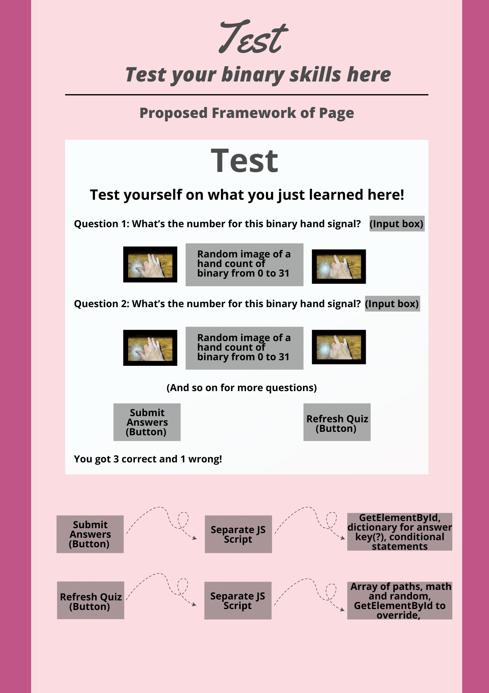

<link rel="stylesheet" href="index.css">

<!---Heading text-->
<h1 class="centered-title">Project WRONG</h1>

<h2>Jason Gao, Rayyan Darugar, Grayson Guyot, Nathan Obodovski</h2>

<!--Image work-->

    
    

<!--Buttons-->

  <button href="https://nathaniel633.github.io/WRONG/2023/11/15/Learning-Carousel_IPYNB_2_.html">Learn!</button>
  <button href="https://wikipedia.org">Test!</button>

